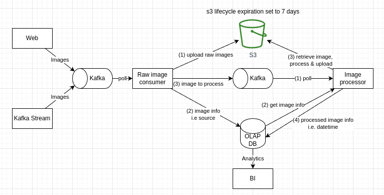

# System Design

* All component should support high availability so no single point of failure.
* Both kafka can share a cluster, using different topics. Separated in diagram is only for visual purposes.
* Web & kafka stream should be different topics for source differentiation. 
* Raw image consumer is included to preprocess some basic info. 
* Since raw image consumer uploaded raw image to s3, the message it produces can just contain s3 file directory.

# Cloud Provider Options & Services
## AWS
Kafka: `Amazon SQS`  
S3: `Amazon S3`  
OLAP DB: `Amazon Reshift`/`Amazon Aurora`  

## GCP
Kafka: `Cloud Pub/Sub`  
S3: `Cloud Storage`  
OLAP DB: `BigQuery`/`Google Spanner`  
