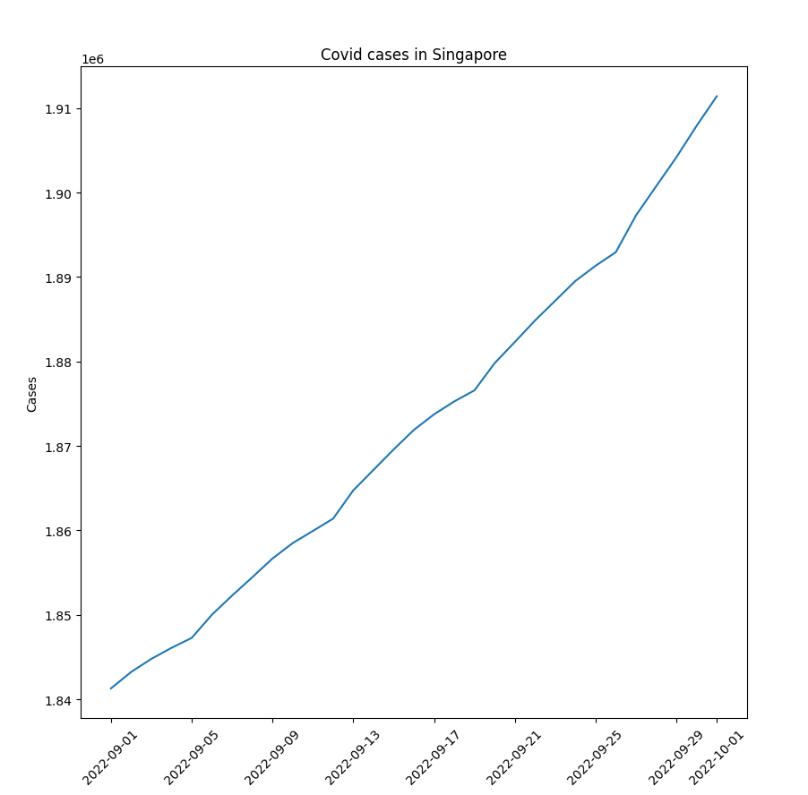

# Charts & API
1. Install requirements
    ```
    pip install -r requirements.txt
    ```
2. Run `plot_covid.py` with our without parameters.   
   Parameters are start & end date in 'dd/mm/yy' format.  
   Date format error or no parameters will default to today() - 3 months.  
   ```
   python plot_covid.py 
   ```
   ```
   python plot_covid.py 01/09/22 01/10/22 
   ```
3. Added a convenience docker-compose.yml to test locally but it doesn't show the plot image.  
   Better to use something like jupyter / google colab. Or can just create `venv` and run on machine.
   ```
   $ docker compose run process_data
   ```

